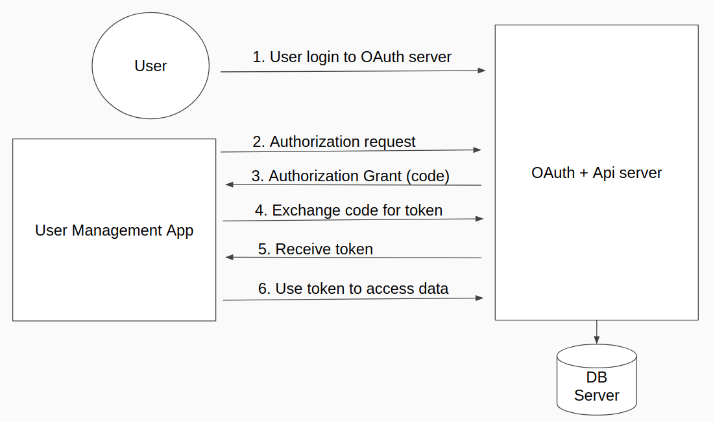

# ERT User Management App

ERT User Management App is a web application to manage (create/edit) user info in ERT system.

Firstly, ERT Management App must be authorized by user via [ERT OAuth Server](https://github.com/huymluu/ert-auth).  
Then, user can use ERT User Management App to manage data in ERT system.

## As an OAuth client

ERT User Management App is an OAuth client with configuration:
```
client_id:     'abc123'
client_secret: 'ssh-secret'
```

For simplicity, its info is already registered with ERT OAuth Server.

## Authorization flow



## Screenshots

### 1. ERT User Management App homepage

This is web app homepage without logged in
(`localhost:8000`)


### 2. OAuth Server login form

When clicked in `login via OAuth`, user will be redirected to OAuth server login form (`localhost:7000/login`)


### 3. OAuth Server authorize app

After logged in, user will be asked to allow ERT User Management App to access to data.


### 4. ERT User Management App

After user authorized access, user will be redirected to ERT User Management App.  
Now the app has access token, and can manage data.


### 5. Log out of ERT User Management App

User can click Logout to log out of ERT User Management App.

Note that ERT User Management App still can access to API, because access token is still valid.
 
### 6. Revoke authorization of ERT User Management App

If you don't want ERT User Management App has access to your data, you can revoke authorization in OAuth Server `localhost:7000` 


## Configuration

Please see `./config/default.js`. Some main configurations:
```
Webapp port:         8000
OAuth authorize_url: http://localhost:7000/dialog/authorize
OAuth token_url:     http://localhost:7000/oauth/token
OAuth client_id:     abc123
OAuth client_secret: ssh-secret
OAuth redirect_uri:  http://localhost:8000/oauth/authorized
API url:             http://localhost:7000/api
```

## Usage

### For development
```
npm install
npm run dev
```

### For production (run in host)

```
npm start
```

### For production (dockerize)

```
docker-compose up -d
```